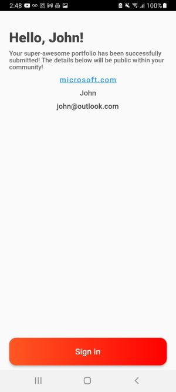

# Flip Grid Mobile

This project uses the Flutter framework.
## Getting Started

This project is a starting point for a Flutter application. It contains two screens: Sign Up and Confirmation

A few resources to get you started if this is your first Flutter project:

- [Lab: Write your first Flutter app](https://flutter.dev/docs/get-started/codelab)
- [Cookbook: Useful Flutter samples](https://flutter.dev/docs/cookbook)

For help getting started with Flutter, view our
[online documentation](https://flutter.dev/docs), which offers tutorials,
samples, guidance on mobile development, and a full API reference.

### Plugins Used

* MobX: Resposible for the App State Management
* Page Transition: Responsible adding animation during the app navigation
* Line Icons: Set of icons
* Validators: Used to validate url and email
* url_launcher: Adds a functinoal link to the website

Plugins can be found [here](https://pub.dev/)